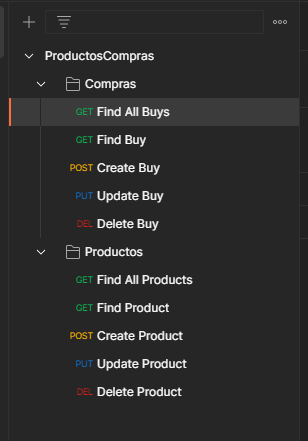
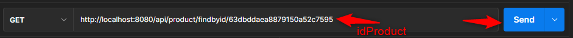
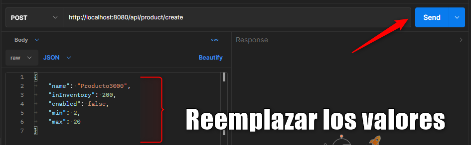
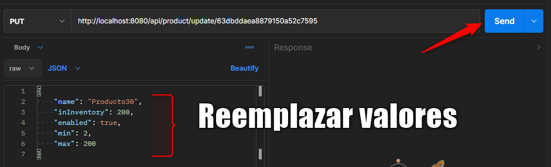
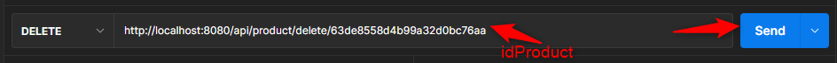
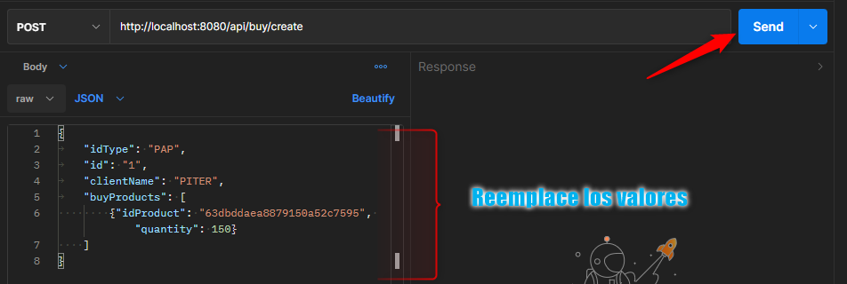
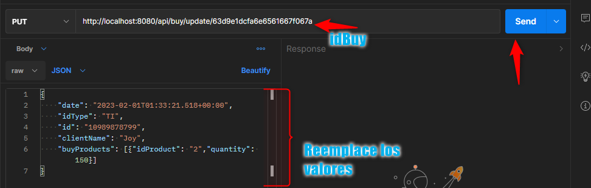
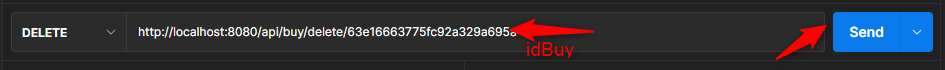

# Reto Backend Talent Zone Productos-Compras

## Instrucciones:

* Para ejecutar y probar el proyecto, descarque o clone la rama 'main' del repositorio https://github.com/certhakzu/products-buys-talent-zone.git
* Asegurese de teer instalado JAVA 17 y Gradle en su equipo local.
* Compile y ejecute el proyecto (de preferencia en el IDE IntelliJ).
* Para probar la API, importe desde Postman el archivo con la colección de consultas para la misma que se encuentra en la raiz del proyecto y tiene como nombre 'Productos_Compras_postman_collection.json'. Debería verse algo asi:

Una vez hecha la importación, puede consumirla de la siguiente manera:
    
### Find All Products

### Find a Product

### Create a Product

### Update a Product

### Delete a Product

### Find All Buys

### Find a Buy

### Create a Buy

### Update a Buy

### Delete a Buy

# Arquitectura

Se usa el plugin de bancolombia para arquitectura hexagonal de manera reaciva con WebFlux.

